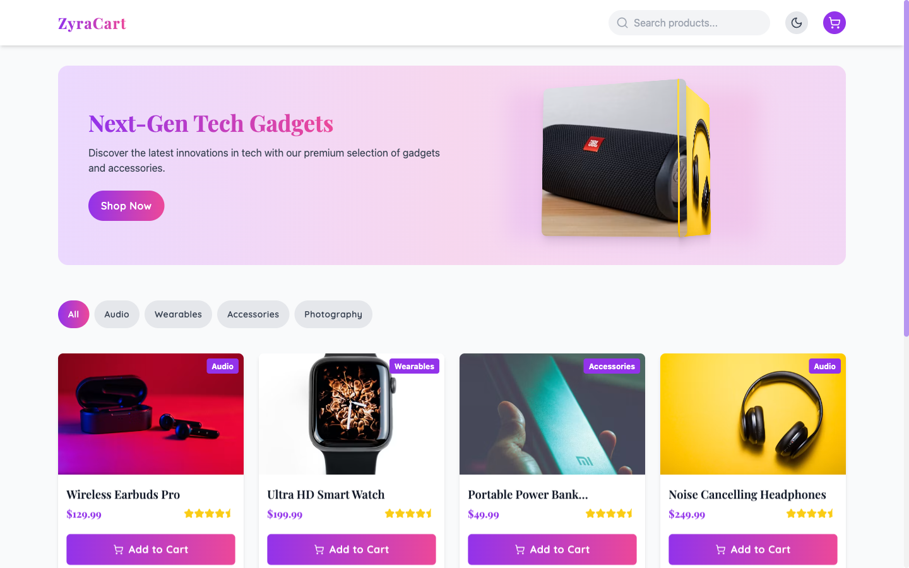
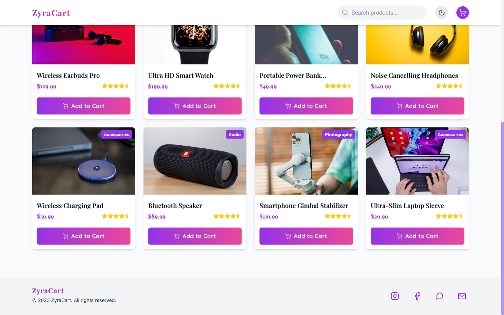

# ZyraCart

<div align="center">

      

</div>

A premium tech-gadget e-commerce single page application built with Next.js, TypeScript, Tailwind CSS, and Framer Motion. Browse next-gen gadgets by category, add them to a cart, and check out — wrapped in an animated, typography-forward storefront.

## Features

- **Animated splash loader** into a polished hero section
- **Product catalog** with category filters (Audio, Wearables, and more)
- **Product detail views** with imagery via next/image
- **Shopping cart** with quantity management and totals
- **Checkout flow** with order confirmation
- **Custom typography** — Playfair Display + Quicksand via next/font
- **Icon system** via lucide-react
- **Framer Motion transitions** across views and elements
- **Fully responsive** layout with dark-mode-aware styles

## Tech Stack

| Layer | Technology |
|---|---|
| Framework | Next.js 14 (Pages Router) |
| Language | TypeScript |
| Styling | Tailwind CSS |
| Animation | Framer Motion |
| Icons | lucide-react |
| Fonts | next/font/google |

## 📸 Screenshots

### Home — Hero



### Featured Products



## Getting Started

### Prerequisites

- Node.js 18+
- npm

### Installation

```bash
git clone https://github.com/iabhishek18/zyracart.git
cd zyracart
npm install
```

### Development

```bash
npm run dev
```

Open [http://localhost:3000](http://localhost:3000) in your browser.

### Production Build

```bash
npm run build
npm start
```

## Project Structure

```
├── pages/
│   ├── _app.tsx        # App wrapper, global styles
│   ├── _document.tsx   # HTML document shell
│   └── index.tsx       # Storefront views, cart state, animations
├── public/             # Static assets
├── styles/
│   └── globals.css     # Tailwind directives
├── next.config.mjs
├── tailwind.config.ts
└── tsconfig.json
```

## How It Works

ZyraCart opens with a brief animated loading screen, then reveals the storefront. All navigation — catalog, product detail, cart, checkout — is state-driven within one client component, so transitions are instant and animated by Framer Motion rather than route changes.

## License

MIT
